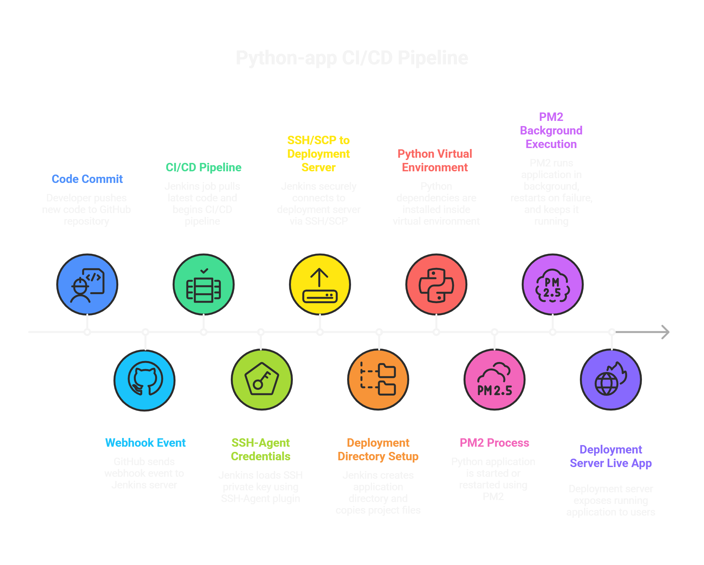

# Python App CI/CD Pipeline using Jenkins and PM2

This project demonstrates a real-world CI/CD pipeline for a Python application using two separate servers.

The pipeline is triggered automatically using a GitHub Webhook, and Jenkins deploys the application to a dedicated deployment server using SSH Agent authentication.

---

## Architectur
Developer → GitHub → Webhook → Jenkins Server → SSH Agent → Deployment Server


---

**This project demonstrates a real-world CI/CD pipeline for a Python application using two separate servers:** 
1. Jenkins Server
- Hosts Jenkins
- Receives webhook events from GitHub
- Jenkins Server for CI/CD automation
- Uses SSH Agent credentials to access the deployment server

2. Deployment Server (EC2)
- Hosts the Python application
- Receives files from Jenkins via SCP
- Runs the application using PM2
- Deployment Server (AWS EC2) for running the application

---

[jenkinsfile](./jenkinsfile) Contains all stages to clone the repository, deploy the application, and manage the Python app using PM2.

---

## SSH-Agent Plugin
- SSH private key is stored securely in Jenkins credentials
- Jenkins loads the key during pipeline execution
- No passwords are used
- Secure and production-ready deployment
---

## Project Structure
```
python-app-CICD/
│
├── app.py
├── requirements.txt
├── Jenkinsfile
├── README.md
├── architecture/
└── test/
```
---
## Author
**Satish Pathade**
AWS Cloud & DevOps Engineer